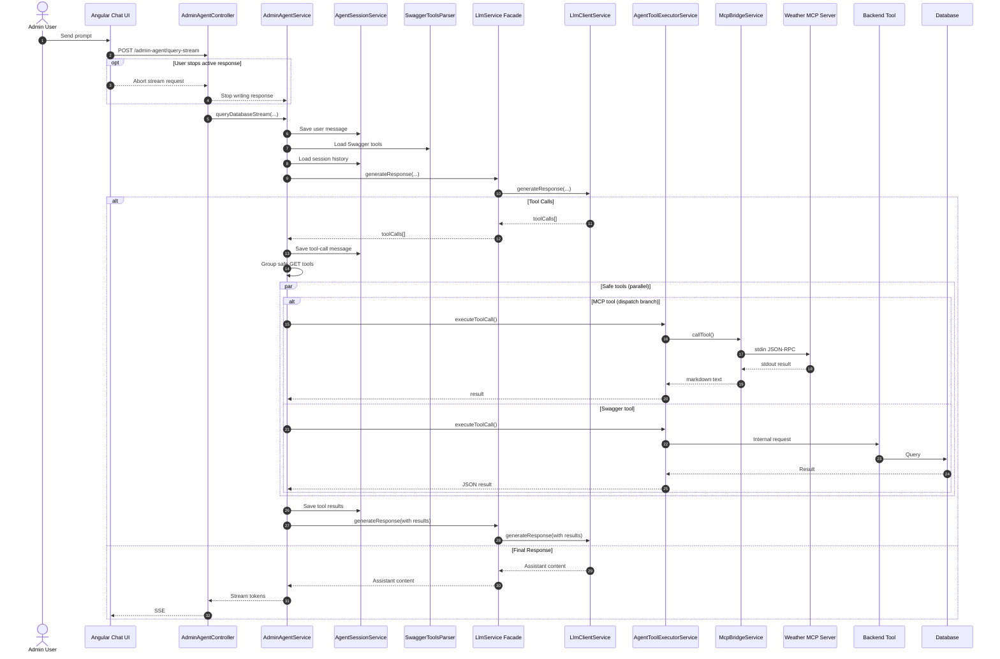
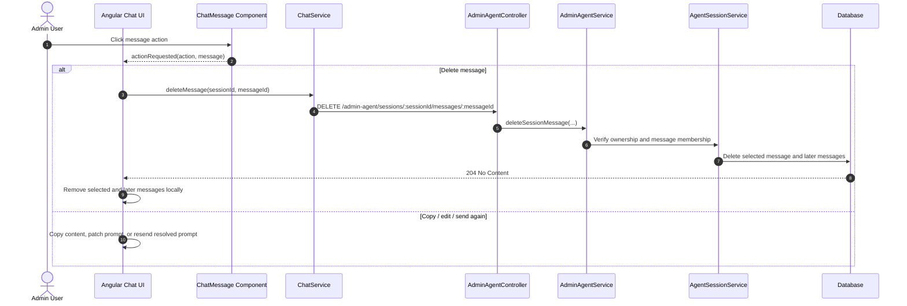
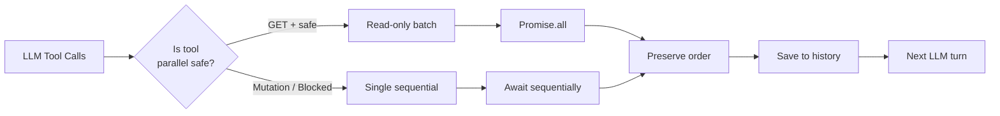
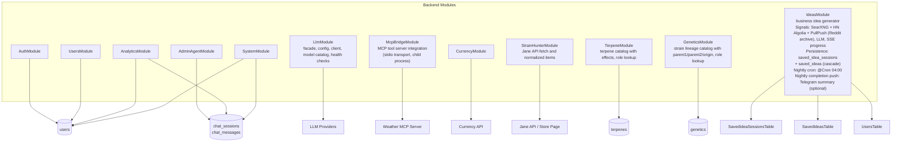
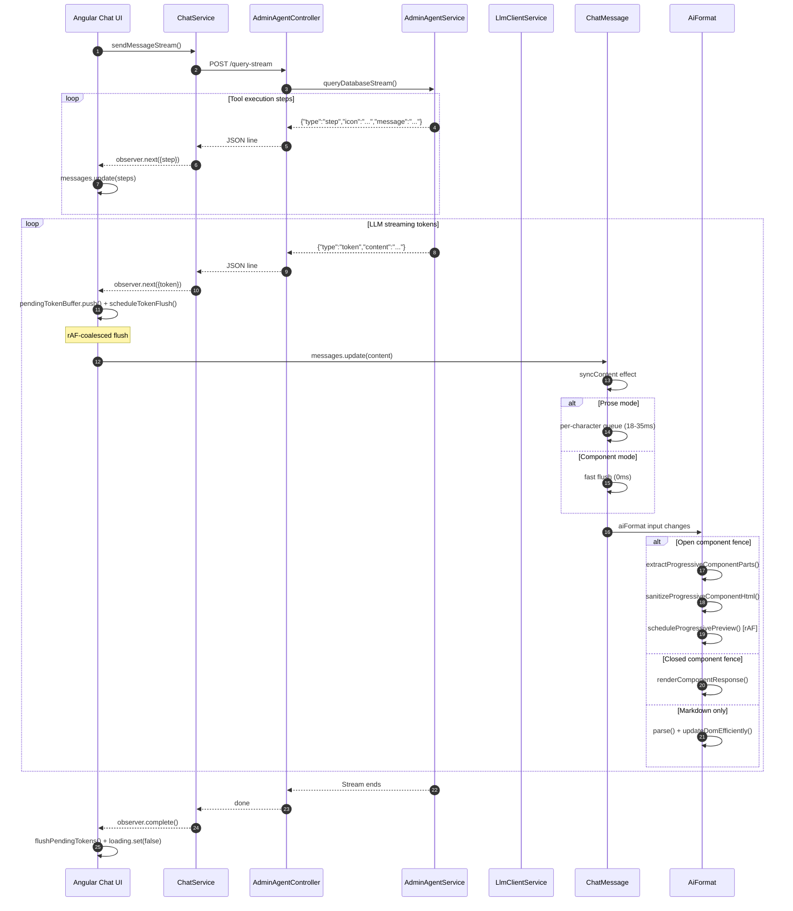
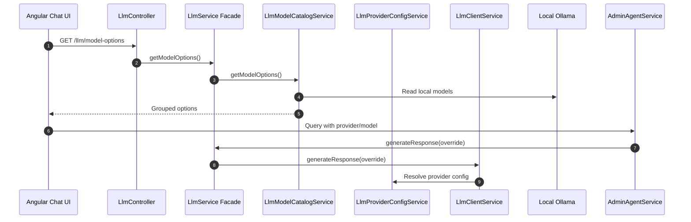
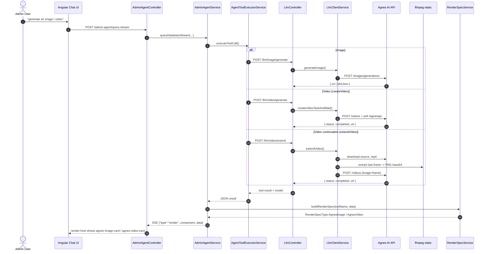
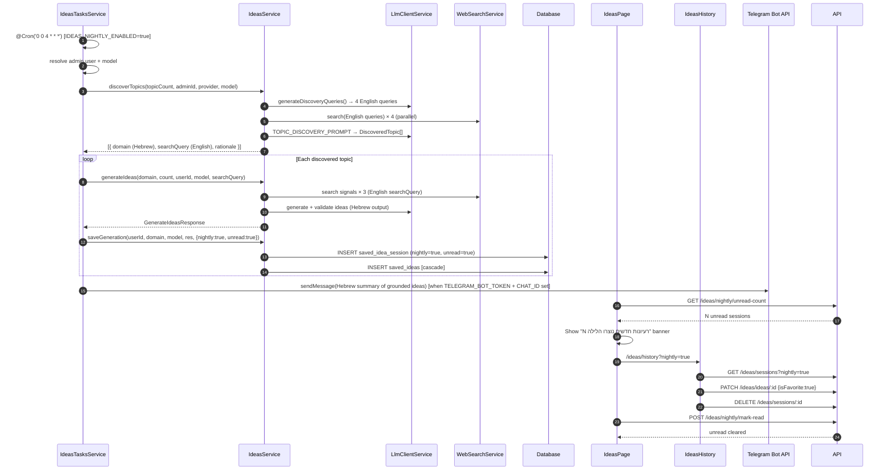

# Agentic Admin Architecture Diagram

This document describes the current high-level architecture of the Agentic Admin system.

The system is a full-stack admin application:

- Angular frontend for chat, authentication, layout, and admin screens.
- NestJS backend for REST APIs, authentication, database access, agent orchestration, and LLM access.
- Swagger-generated tool metadata that turns backend endpoints into callable admin-agent tools.
- MCP Bridge for external tool servers (weather-mcp, etc.).
- External providers for LLMs, currency, and local Ollama models.

## System Architecture

```mermaid
flowchart TD
  User[Admin User]

  subgraph Frontend["Angular Frontend"]
    Shell[Main Layout / Sidebar]
    AuthUI[Auth Feature]
    ChatUI[Chat Feature]
    StrainHunterUI[StrainHunter Feature]
    IdeasUI[Ideas Feature]
    SharedTooltip[Shared Tooltip Component]
    ChatMessage[Chat Message Renderer]
    AiFormat[AiFormat Directive]
    FrontendServices[Core HTTP Services]
    FrontendStores[Signal Stores]
  end

  subgraph Backend["NestJS Backend"]
    AppModule[AppModule]
    AuthModule[AuthModule]
    UsersModule[UsersModule]
    AdminAgentModule[AdminAgentModule]
    LlmModule[LlmModule]
    SystemModule[SystemModule]
    McpBridgeModule[McpBridgeModule]
    AnalyticsModule[AnalyticsModule]
    CurrencyModule[CurrencyModule]
    StrainHunterModule[StrainHunterModule]
    TerpeneModule[TerpeneModule]
    GeneticsModule[GeneticsModule]
    WebSearchModule[WebSearchModule]
    IdeasModule[IdeasModule]
  end

  subgraph AgentCore["Admin Agent Core"]
    AdminAgentController[AdminAgentController]
    AdminAgentService[AdminAgentService]
    AgentSessionService[AgentSessionService]
    AgentToolExecutor[AgentToolExecutorService]
    SwaggerParser[SwaggerToolsParser]
    McpBridge[McpBridgeService]
    SystemContext[SYSTEM_CONTEXT]
    GenUiSpec[GenUiSpec Constants]
  end

  subgraph LlmCore["LLM Core"]
    LlmController[LlmController]
    LlmService[LlmService Facade]
    ProviderConfig[LlmProviderConfigService]
    ClientService[LlmClientService]
    ModelCatalog[LlmModelCatalogService]
    HealthService[LlmHealthService]
  end

  subgraph Data["Database"]
    UsersTable[(users)]
    ChatSessionsTable[(chat_sessions)]
    ChatMessagesTable[(chat_messages)]
    TerpenesTable[(terpenes)]
    GeneticsTable[(genetics)]
    SavedIdeaSessionsTable[(saved_idea_sessions)]
    SavedIdeasTable[(saved_ideas)]
  end

  subgraph External["External Providers"]
    OpenRouter[OpenRouter API]
    Nvidia[NVIDIA API]
    Ollama[Local Ollama]
    WeatherMcp[Weather MCP Server]
    CurrencyApi[Currency API]
    JaneApi[Jane API / Store Page]
    AgnesAI[Agnes AI API\ntext / image / video]
    TelegramApi[Telegram Bot API\nnightly ideas summary]
  end

  User --> Shell
  Shell --> AuthUI & ChatUI & StrainHunterUI & IdeasUI
  ChatUI --> ChatMessage & FrontendServices
  StrainHunterUI --> SharedTooltip & FrontendServices
  StrainHunterUI --> StrainHunterModule
  IdeasUI --> FrontendServices & FrontendStores
  IdeasUI --> IdeasHistory[IdeasHistory Page\n/ideas/history]
  IdeasHistory --> FrontendStores
  ChatMessage --> AiFormat
  AuthUI --> FrontendServices
  FrontendServices --> AuthModule & UsersModule & AdminAgentController & LlmController & TerpeneModule & GeneticsModule & StrainHunterModule & IdeasModule

  AppModule --> AuthModule & UsersModule & AdminAgentModule & LlmModule & SystemModule & McpBridgeModule & AnalyticsModule & CurrencyModule & StrainHunterModule & TerpeneModule & GeneticsModule & WebSearchModule & IdeasModule

  AdminAgentModule --> AdminAgentController
  AdminAgentController --> AdminAgentService
  AdminAgentService --> AgentSessionService & AgentToolExecutor & SwaggerParser & McpBridge & SystemContext & LlmService
  AgentToolExecutor --> SwaggerParser & McpBridge & AuthModule & UsersModule & SystemModule & AnalyticsModule & CurrencyModule & StrainHunterModule & TerpeneModule & GeneticsModule
  SwaggerParser --> SwaggerSpec[swagger-spec.json]
  SwaggerSpec --> GenUiSpec

  LlmModule --> LlmController
  LlmController --> LlmService
  LlmService --> ProviderConfig & ClientService & ModelCatalog & HealthService
  ClientService --> ProviderConfig
  ClientService --> OpenRouter & Nvidia & Ollama & AgnesAI
  ModelCatalog --> ProviderConfig & Ollama
  ModelCatalog -->|public metadata: context + pricing| OpenRouter
  HealthService --> ClientService & ProviderConfig & ModelCatalog

  LlmController -->|image / video gen| ClientService
  ClientService -->|extendVideo| Ffmpeg[ffmpeg-static\nlast-frame extract]
  Ffmpeg -->|base64 frame| AgnesAI

  AuthModule & UsersModule --> UsersTable
  AgentSessionService --> ChatSessionsTable & ChatMessagesTable
  AnalyticsModule --> UsersTable & ChatSessionsTable & ChatMessagesTable

  McpBridge --> WeatherMcp
  CurrencyModule --> CurrencyApi
  StrainHunterModule --> JaneApi
  IdeasModule --> LlmModule & WebSearchModule & TelegramApi
```



## Chat And Tool Execution Flow



## Chat Message Actions Flow



## Tool Safety And Parallel Execution



## Backend Module Responsibilities



## GenUI Rendering Path

````mermaid
flowchart TD
  ToolEndpoint[Backend Endpoint\nwith genUiSpec] --> SwaggerSpec[swagger-spec.json]
  SwaggerSpec --> Parser[SwaggerToolsParser]
  Parser --> ToolDesc[Tool Description\n+ GenUI Instruction]
  ToolDesc --> LLM[LlmService Facade]
  LLM --> Client[LlmClientService]
  Client --> Component[```component]
  Component --> Stream[SSE Stream]
  Stream --> AiFormat[AiFormat Directive]
  AiFormat --> ProgressivePreview[Progressive Preview\nrAF-throttled]
  AiFormat --> Skeleton[Skeleton Loader]
  AiFormat --> FinalRender[Sanitized GenUI Component]

  ToolResult[Tool JSON Result] --> RenderSpec[RenderSpecService]
  RenderSpec -->|toolName mapping| SpecType[RenderSpecType\nagnes-image / agnes-video / ...]
  SpecType --> ChatBlock[Angular Chat Block\nagnes-image-card / agnes-video-card]
  ChatBlock --> RenderHost[RenderHostComponent]
  RenderHost --> ChatUI[Chat Message Bubble]
````

## Streaming Event Flow



See [genui-streaming-protocol.md](architecture/genui-streaming-protocol.md) for the full protocol reference.

## Model Selection Path



## Agnes Multimodal Generation Flow



## Ideas Generation Flow

```mermaid
sequenceDiagram
  autonumber
  actor User as Admin User
  participant IdeasUI as Ideas Page
  participant API as IdeasController
  participant Service as IdeasService
  participant Search as WebSearchService
  participant LLM as LlmClientService
  participant DB as Database

  User->>IdeasUI: Enter domain + count, click "צור רעיונות"
  IdeasUI->>API: GET /ideas/generate/stream?domain=...&count=...
  API->>Service: generateIdeas(domain, count, onProgress, ..., searchQuery?)
  Service->>Service: sanitizeDomain() → cleanDomain; searchTerm = searchQuery || cleanDomain
  Service->>Search: search(English searchTerm queries) × 3 (parallel)
  Search-->>Service: merged results
  Service->>LLM: generateResponse(SIGNAL_GATHERING_PROMPT)
  LLM-->>Service: Signal[]
  Service-->>API: SSE { phase: 0, status: "מחפש סיגנלים..." }
  API-->>IdeasUI: SSE event
  Service->>LLM: generateResponse(IDEA_GENERATION_PROMPT + signals) → Hebrew ideas
  LLM-->>Service: RawIdea[]
  Service-->>API: SSE { phase: 1, status: "מייצר רעיונות..." }
  API-->>IdeasUI: SSE event
  loop Per idea (max 3 parallel)
    Service->>Search: search("competitors for idea "searchTerm"") [English anchor]
    Search-->>Service: results
    Service->>LLM: generateResponse(VALIDATION_PROMPT + results) → Hebrew score/reason
    LLM-->>Service: ValidationResult
  end
  Service->>Service: merge + sort by score
  Service-->>API: SSE { phase: 'done', result: BusinessIdea[] }
  API-->>IdeasUI: SSE event
  IdeasUI->>IdeasUI: render idea cards
  API->>Service: saveGeneration() [best-effort]
  Service->>DB: INSERT saved_idea_session + saved_ideas [transaction]
```

## Ideas Persistence & Nightly Flow



## Ideas API Surface

| Method | Path | Purpose |
|--------|------|---------|
| POST | /ideas/generate | Sync generation (auto-persists) |
| GET | /ideas/generate/stream | SSE stream (auto-persists on phase:done) |
| GET | /ideas/sessions | List sessions (supports ?nightly=, ?favorites=) |
| GET | /ideas/sessions/:id | Full session with ideas |
| DELETE | /ideas/sessions/:id | Delete session + cascade ideas |
| PATCH | /ideas/ideas/:id | Toggle isFavorite |
| GET | /ideas/nightly/unread-count | Count unread nightly sessions |
| POST | /ideas/nightly/mark-read | Clear unread flag |

## Current Architecture Notes

- The backend is the source of truth for available LLM models.
- Swagger metadata is the tool catalog for the admin agent.
- MCP Bridge integrates external tool servers (weather-mcp, etc.) via stdio transport as child processes. MCP tools are merged into the agent's tool list alongside Swagger tools.
- `genUiSpec` is defined in shared constants and attached via Swagger decorators.
- The agent currently runs in a single active flow.
- Read-only tools run in parallel, mutations run sequentially.
- Full conversation history is persisted in the backend.
- Chat message deletion is persistent and deletes the selected message plus later session history to preserve context consistency.
- Active chat streams can be cancelled from the Angular UI by unsubscribing from the stream request, which aborts the underlying fetch.
- The streaming protocol uses newline-delimited JSON with `step`, `token`, and `done` events. See [genui-streaming-protocol.md](architecture/genui-streaming-protocol.md).
- Token updates are rAF-coalesced in the Chat component to reduce signal writes per frame.
- GenUI component streams flush faster (0ms delay, 12-24 char chunks) than prose streams (18-35ms delay, 1-3 char chunks).
- `AiFormat` renders progressive GenUI previews during streaming using a stable preview host element, replacing the skeleton once partial HTML is safely renderable.
- The backend logs `[AdminAgentStream]` with time-to-first-token, total duration, token count, and component count for each stream.
- The system context is split into `SYSTEM_CONTEXT_BASE` (tool rules, security, anti-hallucination) and `SYSTEM_CONTEXT_GENUI` (visual standard, design system). GenUI rules are only included when the prompt contains visual-trigger keywords.
- **Agnes AI multimodal provider** (`agnes-ai` key, `https://apihub.agnes-ai.com/v1`) supports text, image, and video generation. Provider key must be `agnes-ai` (not legacy `agnes`).
- Image generation: `LlmController_generateImage` → `LlmClientService.generateImage`, returns hosted URL or base64. `size` is required; `response_format` lives in `extra_body`.
- Video generation: `LlmController_createVideo` → `createVideoTaskAndWait` which submits the task and polls `getVideoResult` until `completed`, returning a real `.mp4` URL (prevents the agent from hallucinating links).
- Video continuation: `LlmController_extendVideo` → `extendVideo` downloads the source video, extracts the last frame via `ffmpeg-static` (`-sseof -1 -frames:v 1`), and submits an image-to-video task with the frame as a base64 PNG data URI (no external image hosting needed).
- GenUI render blocks for Agnes: `agnes-image` (`agnes-image-card`) and `agnes-video` (`agnes-video-card`) are registered in `RenderHostComponent` and rendered inline in chat instead of markdown links. `RenderSpecService` maps `LlmController_generateImage`/`createVideo`/`extendVideo` to these types.
- Image/video model fallback (`resolveCapabilityModel`) picks the highest-version active model of the requested capability when `modelId` is omitted (e.g. `agnes-image-2.1-flash` over `2.0-flash`). The resolved image model is logged by `LlmController`.
- **Ideas module** (`IdeasModule`) is a business idea generator: `POST /ideas/generate` (sync) and `GET /ideas/generate/stream` (SSE progress). The service runs a 3-phase agentic loop — SearXNG signal gathering → LLM idea generation → per-idea validation — with 60s overall timeout, partial results via `Promise.allSettled`, and weighted rate limiting via `IdeasThrottlerGuard` (extends `ThrottlerGuard`, loops `increment()` `max(count,1)` times). The frontend `IdeasPage` uses `PageStates` and consumes the SSE stream via raw `fetch` + `AbortController`.
- **Ideas persistence:** Every generation (manual or nightly) is persisted to `saved_idea_sessions` + `saved_ideas` tables (FK cascade on delete). Persistence is best-effort in the stream handler — wrapped in try/catch so save failures never break the SSE response. The history page (`/ideas/history`) loads past sessions via `GET /ideas/sessions` with optional `?nightly=` and `?favorites=` filters.
- **Ideas nightly cron:** `IdeasTasksService` runs at 04:00 server time when `IDEAS_NIGHTLY_ENABLED=true`. It first discovers topics via `IdeasService.discoverTopics()` — the LLM generates 4 English search queries (`DISCOVERY_QUERY_GENERATION_PROMPT`), then each query fans out to three signal channels in parallel: SearXNG (best-effort — its engines are frequently suspended/CAPTCHA'd as self-hosted bots), HN Algolia (`searchHackerNews`, no key) and PullPush Reddit archive (`searchRedditArchive`, no key); the latter two return only trusted-domain URLs by construction, and `isTrustedSignalUrl` filters the SearXNG noise. The LLM extracts `DiscoveredTopic[]` via `TOPIC_DISCOVERY_PROMPT`, where `domain` is Hebrew (for display) and `searchQuery` is the English search term. For each topic it calls `generateIdeas(domain, count, userId, model, searchQuery)`: signals and competitor searches hit SearXNG with English-only queries anchored on `searchQuery` (never mixed Hebrew/English), while idea titles/descriptions/scores stay Hebrew. Results save with `nightly=true, unread=true`. The `IdeasPage` calls `GET /ideas/nightly/unread-count` on load and shows a banner with a link to history. `POST /ideas/nightly/mark-read` clears the unread flag.
- **Ideas Telegram notification:** when `TELEGRAM_BOT_TOKEN` + `TELEGRAM_CHAT_ID` are set (both optional), `IdeasTasksService` pushes a Hebrew summary of the generated ideas (sorted by score, capped at 5 per topic, hard-capped at 4000 chars) to the Telegram Bot API (`sendMessage`, JSON body — Hebrew-safe) when the nightly run finishes. `TelegramNotifyService` never throws — failures are logged and skipped, so notifications can never break the cron. The same push fires for the manual admin trigger (`POST /ideas/nightly/trigger`) since it calls `runNightly()`.
